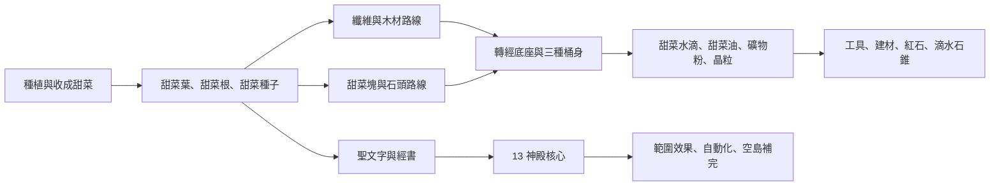
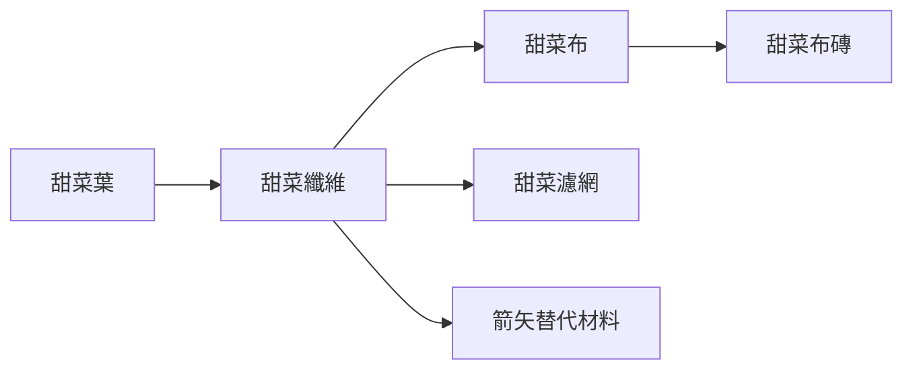
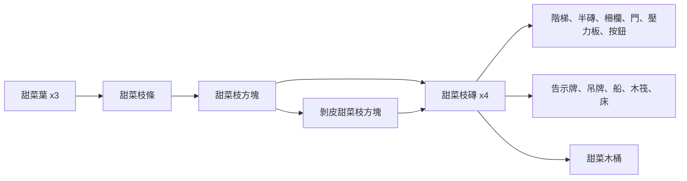
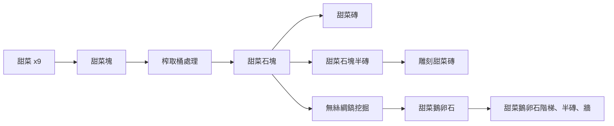
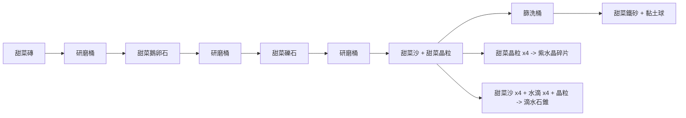
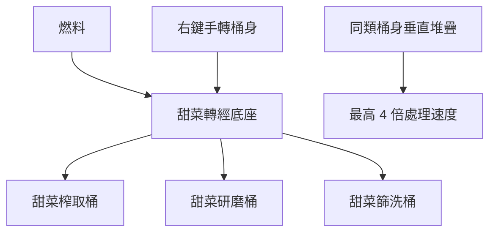
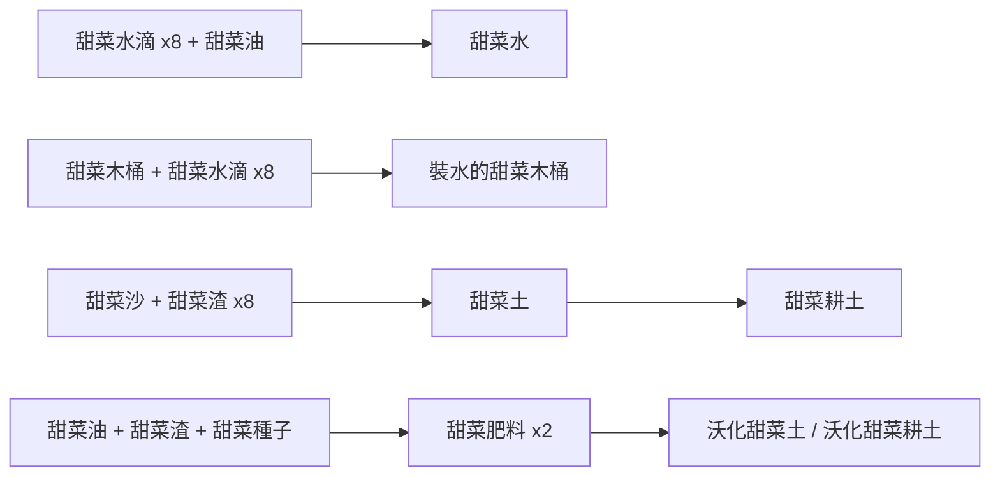
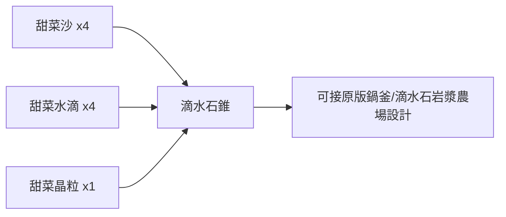

# 甜菜龐克路線總覽

最後更新：2026-08-04

這份文件整理目前 `beetpunk-mod-26.2` 的主要玩法路線、材料鏈、處理方塊、神殿與經書系統。它偏向「玩家與企劃可讀」的說明稿，不是完整程式 API 文件。

## 核心概念

甜菜龐克的目標是讓玩家在極限空島或低資源環境中，從原版甜菜出發，逐步延伸出木材、纖維、石材、礦物、照明、水、肥料、自動化與神殿能力。

主線節奏可以理解成：

## 起始資源

玩家從原版甜菜開始，透過收成與合成取得第一批甜菜材料。

| 來源 | 產物 | 用途 |
|---|---|---|
| 收成熟甜菜 | 原版甜菜、甜菜葉、甜菜種子 | 食物、甜菜塊、纖維、枝條、聖文字起點 |
| 甜菜葉 x2 | 甜菜纖維 x2 | 布料、濾網、箭矢材料 |
| 甜菜葉 x3 | 甜菜枝條 | 木材路線與燃料 |
| 原版甜菜 x9 | 甜菜塊 | 石頭/榨取路線起點 |
| 甜菜纖維 + 甜菜 + 甜菜葉 | 甜菜巡禮帳 | 手冊與朱印帳 |
| 甜菜葉 + 甜菜枝條 x2 | 甜菜巡禮手杖 | 播種、整地、催熟等整合工具 |

## 四大材料路線

### 纖維與布料路線

重點：

- 甜菜纖維類似蜘蛛絲/線材，是濾網、布、箭矢等材料的入口。
- 甜菜布可延伸成布磚與床等生活材料。
- 甜菜濾網是篩洗桶的重要材料。

### 木材路線

重點：

- 甜菜枝條對標原版木棒。
- 甜菜枝方塊對標原木。
- 甜菜枝磚對標原版木材，可製作多數木質衍生方塊。
- 甜菜木材類也可作為轉經底座燃料。

### 石頭路線

重點：

- 甜菜石塊是目前的石頭定位。
- 甜菜磚對標原版石磚。
- 甜菜鵝卵石對標原版鵝卵石，可作為石系加工入口。

### 礦物與特殊材料路線

重點：

- 甜菜鐵砂 x9 可合成甜菜鐵錠。
- 甜菜晶粒可合成紫水晶碎片，也參與滴水石錐路線。
- 甜菜沙現在同時連到土壤、鐵砂、黏土、滴水石錐，是石頭線後段的關鍵中間素材。

## 轉經底座與三桶處理

目前推薦使用「甜菜轉經底座 + 桶身」作為主要處理系統。

### 操作方式

| 操作 | 結果 |
|---|---|
| 對底座右鍵 | 打開處理 UI |
| 對底座上的桶身 Shift + 右鍵 | 打開底座 UI |
| 對桶身右鍵 | 手轉桶身並推進處理 |
| 底座放入燃料 | 自動推進處理 |
| 同類型桶身往上堆疊 | 增加處理速度，最高計算 4 個 |

### 目前燃料

| 燃料 | 燃燒時間 |
|---|---:|
| 甜菜枝條 | 100 ticks |
| 甜菜枝磚 | 300 ticks |
| 原版原木 / 木材 | 300 ticks |
| 甜菜石塊 | 800 ticks |
| 原版木炭 | 800 ticks |
| 甜菜油 | 1600 ticks |
| 原版煤炭 | 1600 ticks |

### 榨取桶

| 輸入 | 輸出 |
|---|---|
| 甜菜塊 | 甜菜石塊 + 甜菜水滴 |
| 甜菜石塊 | 甜菜渣 + 甜菜油 |
| 甜菜種子 | 甜菜渣 + 甜菜油 |

### 研磨桶

| 輸入 | 輸出 |
|---|---|
| 甜菜磚 | 甜菜鵝卵石 |
| 甜菜鵝卵石 | 甜菜礫石 |
| 甜菜礫石 | 甜菜沙 + 甜菜晶粒 |

### 篩洗桶

| 輸入 | 輸出 |
|---|---|
| 甜菜沙 | 甜菜鐵砂 + 黏土球 |
| 甜菜晶粒 | 甜菜紅石粉 |

## 水、土壤與農業

重點：

- 甜菜土與甜菜耕土不會被踩壞。
- 甜菜肥料可升級土壤，也能催熟甜菜。
- 甜菜噴灑器使用甜菜水作為消耗品，走微催熟與灑水路線。
- 甜菜木桶可作為早期水桶替代品。

## 工具、戰鬥與生活補完

| 類型 | 內容 |
|---|---|
| 木質工具 | 甜菜木劍、鎬、斧、鏟、鋤、弓 |
| 鐵質工具 | 甜菜鐵劍、鎬、斧、鏟、鋤 |
| 盔甲 | 甜菜鐵頭盔、胸甲、護腿、靴子 |
| 遠程 | 甜菜木弓、甜菜布/纖維相關箭矢路線 |
| 照明 | 甜菜枝條 + 甜菜油 -> 甜菜火把 x4 |
| 強光 | 甜菜營火 |
| 食物 | 甜菜乾糧、強化甜菜乾糧 |
| 水路 | 甜菜枝筏、箱子甜菜枝筏 |
| 儲存 | 甜菜採收箱 |

## 下界前置路線

下界門目前需要補出岩漿相關條件。已加入的前置是滴水石錐合成：

目前合成：

`甜菜沙 x4 + 甜菜水滴 x4 + 甜菜晶粒 x1 -> 滴水石錐 x1`

待設計：

- 岩漿來源或甜菜熱源。
- 是否使用甜菜油、甜菜紅石粉、甜菜石塊做高階熱源。
- 是否保留原版鍋釜 + 滴水石的慢速岩漿農場感。

## 巡禮帳、聖文字與經書

巡禮帳是玩家手冊與朱印帳的合體：

- 前段：材料路線與作業方塊說明。
- 後段：13 神殿頁面。
- 每頁可呈現聖文字黑色圖案、神殿朱印紅色圖案，以及完成狀態。

經書系統：

經書升級概念：

| 等級 | 概念 |
|---|---|
| LV1 | 1 個聖文字 + 一階墨水 + 基礎材料 |
| LV2 | LV1 經書 + 2 個聖文字 + 二階墨水 |
| LV3 | LV2 經書 + 3 個聖文字 + 三階墨水 |
| LV4 | LV3 經書 + 甜菜天啟 + 聖文字 + 四階墨水 |

神殿核心：

- 每個神殿核心可放入對應神殿的 LV1 -> LV4 經書。
- 必須依序放入，不能跳級。
- 放入 1 本經書等於 LV1，最多 LV4。
- Shift + 右鍵可取回最後一本經書。
- LV4 神殿會有光束效果。
- 神殿效果範圍目前為：`LV x 16` 格，也就是 LV1 16 格、LV4 64 格。

## 13 神殿路線

13 神殿來自原版遊戲中與甜菜相關的 12 種要素，加上最後統合的至高神殿。

| 順序 | 神殿 | 主題 | 目前定位 |
|---:|---|---|---|
| 1 | 萌種神殿 | 甜菜種子 | 播種、起始農業 |
| 2 | 沃土神殿 | 土 | 整地、甜菜土/耕土 |
| 3 | 初芽神殿 | 作物成長早期 | 自然擴散與萌芽 |
| 4 | 清水神殿 | 水 | 甜菜水、灑水、滴灌 |
| 5 | 壯苗神殿 | 作物成長 | 催熟與肥料強化 |
| 6 | 耀光神殿 | 光 | 照明、驅散怪物 |
| 7 | 茂葉神殿 | 甜菜葉 | 纖維、葉片衍生 |
| 8 | 豐根神殿 | 根 | 甜菜塊、根系產能 |
| 9 | 甜菜神殿 | 甜菜物品 | 甜菜主體循環 |
| 10 | 甘湯神殿 | 甜菜湯 | 食物與狀態效果 |
| 11 | 染彩神殿 | 紅色染料 | 染料、色彩、召喚 |
| 12 | 聖豬神殿 | 豬吃甜菜繁殖 | 豬與動物來源 |
| 13 | 至高神殿 | 統合 | 村民、交易與高階便利 |

## 13 神殿 LV1-LV4 效果表

這張表是目前的整體盤點。已經從程式或設計討論能確認的效果會直接寫出；還沒決定或還沒實作的格子先標成「無／待定」。

共同規則：

- 神殿效果範圍為 `LV x 16` 格。
- 每個神殿核心需要依序放入對應的 LV1 -> LV4 經書。
- LV4 是目前設計上最強、最方便、最接近自動化的階段。
- 甜菜天啟可在特定神殿條件下生成生物：聖豬神殿可生成豬，至高神殿可生成村民，染彩神殿目前也可生成豬。

| 順序 | 神殿 | LV1 | LV2 | LV3 | LV4 |
|---:|---|---|---|---|---|
| 1 | 萌種神殿 | 甜菜巡禮手杖範圍播種至少 3x3。 | 播種範圍隨神殿等級擴大。 | 播種範圍繼續擴大。 | 最大範圍播種；每種下第 4 株可免消耗 1 顆甜菜種子。 |
| 2 | 沃土神殿 | 甜菜巡禮手杖可將泥土/草地/甜菜土等轉成甜菜耕土。 | 整地範圍擴大到 3x3。 | 整地時可轉成沃化甜菜耕土。 | 整地範圍擴大到 5x5，並支援沃化。 |
| 3 | 初芽神殿 | 範圍內幼齡甜菜有機率自然成長 1 階。 | 範圍內幼齡甜菜可向鄰近十字方向擴散新苗。 | 擴散允許斜角方向。 | 擴散嘗試次數增加；可把甜菜土/沃化甜菜土預先轉成可種植耕土。 |
| 4 | 清水神殿 | 甜菜噴灑器範圍 +1，補濕甜菜耕土並微機率催熟甜菜。 | 甜菜噴灑器範圍再增加。 | 甜菜噴灑器範圍再增加。 | 甜菜噴灑器最大範圍；每次成功噴灑有 50% 機率不消耗甜菜水。 |
| 5 | 壯苗神殿 | 甜菜巡禮手杖/甜菜肥料可催熟甜菜 1 階。 | 催熟步數提高為 2 階。 | 催熟範圍擴大到 3x3。 | 催熟範圍擴大到 5x5；甜菜肥料有 50% 機率不消耗。 |
| 6 | 耀光神殿 | 範圍內怪物獲得發光效果。 | 範圍內怪物追加虛弱效果。 | 範圍內怪物追加緩速效果。 | 範圍內未命名怪物會被移除。 |
| 7 | 茂葉神殿 | 收成熟甜菜時額外 +1 甜菜葉。 | 收成時有機率額外取得甜菜纖維。 | 收成時額外甜菜葉與甜菜纖維。 | 收成產物優先進附近甜菜採收箱，其次進玩家背包。 |
| 8 | 豐根神殿 | 榨取甜菜塊/甜菜石塊速度提高。 | 榨取甜菜塊時甜菜水滴產量提高。 | 榨取甜菜石塊時甜菜渣產量提高。 | 榨取甜菜石塊時甜菜油產量提高，且速度最高。 |
| 9 | 甜菜神殿 | 收成熟甜菜時有機率額外掉落甜菜。 | 收成範圍擴大到 3x3。 | 收成後嘗試自動補種。 | 收成範圍擴大到 5x5；產物優先進附近甜菜採收箱。 |
| 10 | 甘湯神殿 | 食用甜菜食物時獲得生命回復。 | 追加飽和效果。 | 追加吸收效果，生命回復強度提高。 | 移除飢餓效果並追加抗性。 |
| 11 | 染彩神殿 | 甜菜轉紅色染料時有機率額外產生紅色染料。 | 每次染料轉換固定追加紅色染料。 | 額外紅色染料機率再提高。 | 額外紅色染料優先進附近甜菜採收箱或玩家背包；可用甜菜天啟生成豬。 |
| 12 | 聖豬神殿 | 可用甜菜天啟生成豬；餵豬甜菜時可取得聖豬聖文字。 | 餵豬取得聖豬聖文字機率提高。 | 餵豬取得聖豬聖文字機率再提高。 | 餵豬取得聖豬聖文字機率大幅提高，並額外生成小豬；完成前 12 神殿條件時可產出至高聖文字。 |
| 13 | 至高神殿 | 可用甜菜天啟生成村民。 | 範圍內有職業村民直升大師等級。 | 範圍內村民刷新補貨。 | 範圍內村民交易降價。 |

## 聖文字取得概念

聖文字不是全部都從收甜菜掉落，而是跟每一階主題行為綁定。

| 聖文字 | 概念來源 |
|---|---|
| 萌種聖文字 | 種植甜菜種子時低機率取得 |
| 沃土聖文字 | 沃土/整地相關行為 |
| 初芽聖文字 | 初期成長與萌芽相關 |
| 清水聖文字 | 水、甜菜水、噴灑相關 |
| 壯苗聖文字 | 催熟與肥料相關 |
| 耀光聖文字 | 甜菜火把/營火/光照相關 |
| 茂葉聖文字 | 纖維或甜菜葉加工，需前階神殿認證 |
| 豐根聖文字 | 甜菜塊或根系加工，需前階神殿認證 |
| 甜菜聖文字 | 甜菜主體循環與處理 |
| 甘湯聖文字 | 甜菜乾糧/食物相關，需前階神殿認證 |
| 染彩聖文字 | 甜菜轉紅色染料時機率取得 |
| 聖豬聖文字 | 餵食/繁殖豬相關 |
| 至高聖文字 | 完成前 12 神殿後，由聖豬神殿 LV4 等高階條件產出 |

## 目前最重要的玩家路線

### 早期穩定路線

1. 種甜菜並收集甜菜葉。
2. 用甜菜葉做甜菜枝條、甜菜纖維。
3. 做甜菜枝方塊與甜菜枝磚。
4. 做甜菜巡禮帳與甜菜巡禮手杖。
5. 做甜菜轉經底座與榨取桶。

### 中期材料擴張

1. 甜菜 x9 做甜菜塊。
2. 甜菜塊榨取成甜菜石塊與甜菜水滴。
3. 甜菜石塊加工成甜菜磚、甜菜鵝卵石。
4. 做研磨桶與篩洗桶。
5. 研磨到甜菜沙、甜菜晶粒。
6. 篩洗出甜菜鐵砂、黏土球與甜菜紅石粉。

### 高階生存補完

1. 甜菜鐵砂 x9 做甜菜鐵錠。
2. 做甜菜鐵工具與盔甲。
3. 做甜菜水、甜菜噴灑器、甜菜採收箱。
4. 做滴水石錐，準備岩漿路線。
5. 推進 13 神殿與經書等級。
6. 用神殿 LV4 效果走向範圍加成與自動化。

## 文件後續可拆成網站頁面

如果要放到網站，建議拆成：

- `總覽`：模組目標、空島生存定位、主線流程圖。
- `材料路線`：纖維、木材、石頭、礦物、水、土壤。
- `轉經桶機械`：底座、三桶、燃料、多桶堆疊。
- `神殿與經書`：13 神殿、聖文字、經書、活化 LV1-LV4。
- `下界前置`：滴水石錐、岩漿、下界門規劃。
- `物品索引`：所有方塊與物品清單。

## 待補資料

- 每一種聖文字的精確掉落條件與機率。
- 巡禮帳內文是否與這份總覽同步。
- 岩漿/熱源正式路線。
- 網站版本是否要加入圖片素材、截圖與互動式路線圖。
